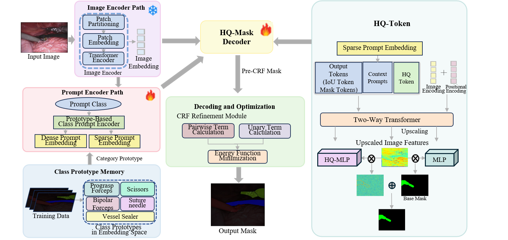
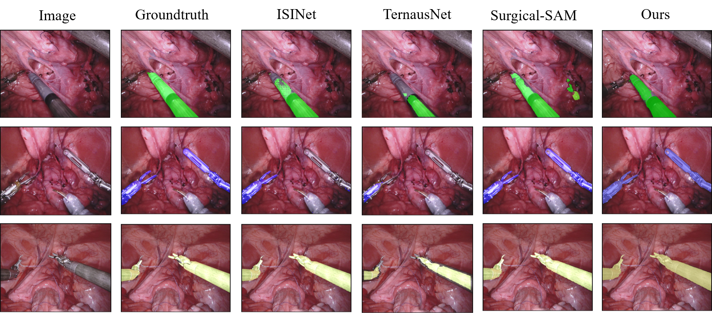
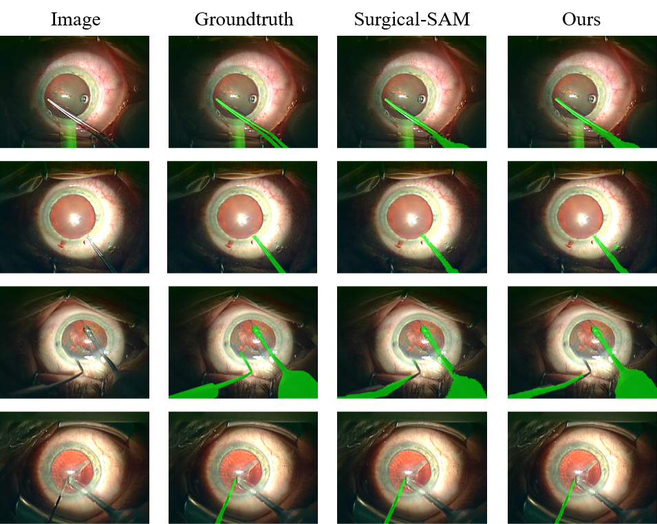

# CSAM-HQ: A Multi-stage Refinement Framework for Surgical Instrument Segmentation based on SAM and Probabilistic Graphical Models
## 1. 🎯 Method Overview (方法总览)

### 🚀 Flowchart


> **Description:**
> The proposed architecture is a high-quality surgical instrument segmentation framework based on the Segment Anything Model (SAM). As shown in the figure, the pipeline consists of four key components:
>
> 1. **Image Encoder Path (Frozen ❄️):** Utilizes a pre-trained Transformer-based encoder (e.g., ViT) to extract image embeddings from input surgical frames. The weights are frozen during training to leverage robust feature representations from foundation models.
> 2. **Prototype-Based Prompt Encoder (Trainable 🔥):** Unlike standard geometric prompts (points/boxes), this module integrates a **Class Prototype Memory**. It retrieves specific instrument prototypes (e.g., Grasping forceps, Scissors, Vessel Sealer) from the embedding space to generate semantic-aware prompts. This path is fully trainable to adapt to the surgical domain.
> 3. **HQ-Mask Decoder with HQ-Token:** The core decoder fuses image embeddings with sparse prompt embeddings. It introduces a specialized **HQ-Token** into the input sequence of the Two-Way Transformer. This token, combined with **HQ-MLP**, captures high-frequency details to correct mask errors, fusing with the Base Mask to produce a refined High-Quality Mask.
> 4. **CRF Refinement Module:** A post-processing "Decoding and Optimization" stage that employs a Conditional Random Field (CRF). It calculates pairwise and unary terms to minimize an energy function, further refining the mask boundaries for precise segmentation output.

---

## 2. 📂 Project Structure (代码树)

The organized directory tree of this project is presented below:

```text
CSAM-HQ/
├── assets/                  # Images and visualization outcomes used in README
├── ckp/                     # Directory for pre-trained foundation weights (Req 9)
│   └── sam_hq_vit_h.pth     # Frozen SAM ViT-H core backbone
├── data/                    # Directory for storing downloaded raw medical benchmarks
│   ├── EndoVis2017/
│   ├── EndoVis2018/
│   └── CATARACTS/
├── segment_anything/        # Official Segment Anything Model (SAM) base framework
│   ├── modeling/            # SAM internal architectures
│   ├── utils/               # SAM internal image/mask utilities
│   ├── build_sam.py
│   └── predictor.py
├── surgicalSAM/             # Main application workflow code for CSAM-HQ
│   ├── tools/               # Auxiliary validation and helper toolkits
│   ├── work_dirs/           # Automatically generated checkpoints during training
│   ├── train.py / ctrain.py # Main training pipeline execution scripts
│   ├── inference.py         # Standard prompt-free evaluation script
│   ├── inference-crf.py     # End-to-end inference script integrating CRF module
│   ├── model.py             # Mask decoder enhanced with learnable HQ-Token
│   ├── model_forward.py     # Custom prototype forward pass paradigms
│   ├── dataset.py           # Standard surgical instrument dataset loader
│   ├── dataset_crf.py       # Specialized dataset loader adapted for CRF logic
│   ├── utils.py             # Core metric computation metrics (IoU, mcIoU)
│   ├── utils_crf.py         # DenseCRF post-processing execution functions
│   └── HD95.py              # Dedicated Hausdorff Distance evaluation engine
├── sample_data/             # Mini-subset data for instant inference testing (Req 8)
│   ├── images/              # 1-2 sample surgery frames for immediate run
│   └── masks/               # Corresponding ground truth masks
├── .gitignore
├── LICENSE
├── requirements.txt         # Environment dependency manifest
└── README.md                # This instruction document
```

## 3. 📊 Dataset Information & Data Splitting (数据集介绍与拆分原则)

We evaluate our method on three public benchmarks. Please download the raw frames/features from the following official portals:

- **EndoVis2017:** [Grand Challenge Portal](https://github.com/wenxi-yue/SurgicalSAM/blob/main/README.md/https://ieee-dataport.org/open-access/cataracts?check_logged_in=1)
- **EndoVis2018:** [Robotic Scene Segmentation Challenge](https://github.com/wenxi-yue/SurgicalSAM/blob/main/README.md/https://ieee-dataport.org/open-access/cataracts?check_logged_in=1)
- **CATARACTS:** [IEEE Dataport Portal](https://ieee-dataport.org/open-access/cataracts)

### ✂️ Train-Validation Splitting Protocols (Strictly Matching Paper)
To ensure unbiased evaluation, the dataset splitting principles strictly follow the competition constraints and patient-independence rules:
- **EndoVis2017:** Strictly follows the standard **4-fold cross-validation** protocol as requested by the challenge.
- **EndoVis2018:** Adopts the official sequence-based training and validation splits.
- **CATARACTS:** Divided according to the **patient identities**, where **12 patients** are explicitly isolated for training and **4 patients** are preserved for validation to ensure absolute cross-patient generalization.

---

## 4. ⚙️ Training Process & Parameter Settings (训练过程与代码)

### Environment Setup
First, install the required dependencies:
```bash
pip install -r requirements.txt
```
💡 Note: If pydensecrf fails to install due to C++ compilation or wheel mismatches on newer Python versions, please install it directly from the updated repository:
```bash
pip install git+[https://github.com/lucasb-eyer/pydensecrf.git](https://github.com/lucasb-eyer/pydensecrf.git)
```
### Implementation Details & Hyperparameters

We implemented the model using **PyTorch**. The input images were resized to **1024×1024**. Following the setup in Surgical-SAM, we utilized the **frozen SAM ViT-H encoder** as the backbone to extract high-level features. Only the **prompt encoder** and **mask decoder** were fine-tuned during training.

#### Key Hyperparameters

| Parameter | Value | Description |
| :--- | :--- | :--- |
| **Backbone** | SAM ViT-H | **Frozen** weights (not trained) |
| **Input Resolution** | 1024 $\times$ 1024 | - |
| **Batch Size** | 32 | - |
| **Optimizer** | Adam | - |
| **Loss Function** | Contrastive Loss | Temperature $\tau = 0.07$ |
| **Device** | 1x NVIDIA RTX 4090D | Single GPU training |

#### Dataset-Specific Settings

Different settings were applied depending on the dataset used (EndoVis2017, EndoVis2018, or CATARACTS):

| Dataset | Learning Rate (LR) | Prototype Count ($n$) |
| :--- | :---: | :---: |
| **EndoVis 2017** | 0.001 | 2 |
| **CATARACTS** | 0.001 | 2 |
| **EndoVis 2018** | 0.0001 | 4 |

> **Note:** As mentioned in the paper, we set the prototype count $n=2$ for EndoVis2017 and CATARACTS, and $n=4$ for EndoVis2018 due to the complexity differences.

Training Steps 
To initiate the automated training loops from scratch, execute the following commands:
```bash
python train.py  --dataset endovis_2017\CATARACTS  --fold 0
python train.py  --dataset endovis_2018
```

## 5. 🔮 Inference Engine & Core Code Snippet (推理代码与演示)

To satisfy the ease-of-use and reproducible benchmarks requirement, we provide both an end-to-end command-line execution interface and a programmatic breakdown of our core inference pipeline.

### 💻 Core Pipeline Walkthrough (核心前向前传与 CRF 耦合逻辑)
Below is the simplified programmatic workflow implemented inside `surgicalSAM/inference-crf.py`. It showcases how our framework sequentially couples the neural network embeddings with the probabilistic graphical post-processing:

```python
import torch
import torch.nn.functional as F
from utils_crf import apply_crf
from model_forward import model_forward_function

def execute_csam_hq_inference_step(dataloader, models, learnable_prototypes, device):
    """
    Programmatic skeleton demonstrating the multi-stage inference pipeline.
    Matches the exact timeline counters and tensor interpolation sequence in our repository.
    """
    protoype_prompt_encoder, sam_prompt_encoder, sam_decoder = models
    
    # 1. Fetch learnable categories prototypes matrix from embedding space
    prototypes = learnable_prototypes()
    
    for sam_feats, mask_names, cls_ids, _, _, images in dataloader:
        sam_feats = sam_feats.to(device).float()
        cls_ids = cls_ids.to(device)
        
        # --- Stage 1: Pure Neural Network Model Forwarding (CSAM-HQ Core) ---
        preds, preds_quality = model_forward_function(
            protoype_prompt_encoder, sam_prompt_encoder, sam_decoder, 
            sam_feats, prototypes, cls_ids
        )
        
        # Match resolution spatial scale via Bilinear Interpolation
        orig_h, orig_w = images.shape[1], images.shape[2]
        if len(preds.shape) == 3:
            preds = preds.unsqueeze(1)
        if preds.shape[-2:] != (orig_h, orig_w):
            preds = F.interpolate(preds, size=(orig_h, orig_w), mode='bilinear', align_corners=False)
            
        # --- Stage 2: Dense CRF Topology Post-Processing Optimization ---
        current_img_np = images[0].numpy().astype(np.uint8)
        if current_img_np.max() > 0:
            # Executes pixel-wise appearance and spatial geometric consistency alignment
            refined_prob = apply_crf(preds[0], current_img_np)
            
            # Converts probability maps back to unstable-resilient Logits
            eps = 1e-6
            refined_prob = np.clip(refined_prob, eps, 1 - eps)
            refined_logits = np.log(refined_prob / (1 - refined_prob))
            
            # Pack back to tensor formats for final mask tracking dictionary evaluation
            final_pred = torch.from_numpy(refined_logits).to(device).unsqueeze(0).unsqueeze(0)
            
        return final_pred
```
### 🏃 Command Line Inference Execution (命令行运行指南)

Before running, ensure you have navigated into the application repository: `cd surgicalSAM`.

#### 🚀 1. Full Proposed Method (CSAM-HQ with CRF Refinement)
To execute the complete end-to-end inference pipeline including the DenseCRF probabilistic graphical post-processing module:

```bash
# Run on EndoVis2018 validation sets
python inference-crf.py --dataset endovis_2018

# Run on EndoVis2017 validation sets (Specify target Fold partition)
python inference-crf.py --dataset endovis_2017 --fold 0

# Run on Cross-Domain CATARACTS dataset (Automated resolution adaptation to 768x1024)
python inference-crf.py --dataset Cataracts --fold 0
```

#### 🧪 2. Baseline Model Evaluation (Ablation Study without CRF)

To run the model variants without the CRF post-processing module (e.g., to systematically reproduce the ablation study baselines or evaluate raw network prediction speeds):

```bash
# Run baseline evaluation without CRF post-processing
python inference.py --dataset endovis_2018
```

### 📦 Outputs Verification

The quantitative inference speed statistics (Model FPS, CRF latency per frame) will be displayed on the screen, and color-mapped predicted masks will be securely generated and partitioned under the `./predictions/` directory matching the designated dataset naming scopes.

Checkpoints
The trained model weights will be saved in the ./work_dirs/datasets  directory.


## 6. Results
We compare our **CSAM-HQ** with state-of-the-art methods on three public datasets: EndoVis2017, EndoVis2018, and CATARACTS. The best results are highlighted in **bold**.

### 🏆 EndoVis2017 & EndoVis2018
Performance comparison on robotic surgical instrument segmentation.

| Dataset | Models | Ch. IoU $\uparrow$ | IoU $\uparrow$ | McIoU $\uparrow$ | BF | PF | LND | VS | GR | SI | MCS | UP | CA | Params $\downarrow$ |
| :---: | :--- | :---: | :---: | :---: | :---: | :---: | :---: | :---: | :---: | :---: | :---: | :---: | :---: | :---: |
| **EndoVis**<br>**2017** | ISINet | 55.62 | 52.20 | 28.96 | 38.70 | 38.50 | 50.09 | 27.43 | 2.10 | - | 28.72 | 12.56 | - | 162.52M |
| | TernausNet | 35.27 | 12.67 | 10.17 | 13.45 | 12.39 | 20.51 | 5.97 | 1.08 | - | 1.00 | 16.76 | - | 32.20M |
| | MF-TAPNet | 37.25 | 13.49 | 10.77 | 16.39 | 14.11 | 19.01 | 8.11 | 0.31 | - | 4.09 | 13.40 | - | 37.73M |
| | Surgical-SAM | 69.94 | 69.94 | 67.03 | 68.30 | **51.77** | 75.52 | 68.24 | 57.63 | - | **86.95** | **60.80** | - | **4.65M** |
| | **CSAM-HQ (Ours)** | **71.186** | **71.186** | **69.29** | **72.011** | 39.603 | **76.140** | **69.162** | **63.645** | - | 67.784 | 49.213 | - | 4.99M |
| | | | | | | | | | | | | | | |
| **EndoVis**<br>**2018** | ISINet | 73.03 | 70.94 | 40.21 | 73.83 | 48.61 | 30.98 | - | - | 37.68 | - | - | 0.00 | 162.52M |
| | TernausNet | 46.22 | 39.87 | 14.19 | 44.20 | 4.67 | 0.00 | - | - | 0.00 | - | - | 0.00 | 32.20M |
| | MF-TAPNet | 67.87 | 39.14 | 24.68 | 69.23 | 6.10 | 11.68 | - | - | 14.00 | - | - | 0.91 | 37.73M |
| | Surgical-SAM | 71.233 | 71.233 | 67.18 | **79.139** | 51.353 | **89.271** | - | - | 84.43 | - | - | 31.64 | **4.65M** |
| | **CSAM-HQ (Ours)** | **74.536** | **74.536** | **71.92** | 75.003 | **56.531** | 88.631 | - | - | **93.334** | - | - | **46.10** | 4.99M |

> **Abbreviations & Technical Notes:**
> * **BF**: Bipolar Forceps, **PF**: Prograsp Forceps, **LND**: Large Needle Driver, **VS**: Vessel Sealer (EndoVis2017 only)
> * **GR**: Grasping Retractor (EndoVis2017 only), **SI**: Suction Instrument (EndoVis2018 only)
> * **MCS**: Monopolar Curved Scissors (EndoVis2017 only), **UP**: Ultrasound Probe (EndoVis2017 only), **CA**: Clip Applier (EndoVis2018 only)
> * **↑** indicates higher values are better.
> * 💡 **Note:** Challenge IoU and standard IoU are identical for SAM-based methods because the class-prototype prompt mechanism effectively eliminates false positive masks for absent categories across all frames, making the calculation scopes completely overlap.

### 👁️ CATARACTS
Generalization performance comparison on cataract surgery dataset.

| Models | Ch. IoU $\uparrow$ | IoU $\uparrow$ | McIoU $\uparrow$ | Spatula | PT | LI | CF | IK | SK | KF | Params |
| :--- | :---: | :---: | :---: | :---: | :---: | :---: | :---: | :---: | :---: | :---: | :---: |
| Surgical-SAM | 55.59 | 55.59 | 57.296 | 57.042 | 61.91 | 57.29 | 50.53 | 64.876 | **56.59** | 1.01 | **4.65M** |
| **CSAM-HQ (Ours)** | **57.57** | **57.57** | **61.67** | **57.32** | **66.19** | **58.91** | **54.60** | **72.17** | 53.43 | **17.35** | 4.99M |

> **Abbreviations:**
> **PT**: Phacoemulsification Tip, **LI**: Lens Injector, **CF**: Capsulorhexis Forceps, **IK**: Incision Knife, **SK**: Slit Knife, **KF**: Katena Forceps.

### 7.🎨 Visual Results (Qualitative Analysis)

To demonstrate the qualitative superiority of **CSAM-HQ**, we provide visual comparisons across challenging surgical environments.

#### 1. Boundary Refinement on EndoVis2017
The figure below showcases the qualitative segmentation performance. Each row represents a distinct challenging surgical scene featuring illumination variations, specular reflections, or instrument overlapping. Compared to prior CNN-based methods (ISINet, TernausNet) and the foundation model baseline (Surgical-SAM), our framework produces masks with significantly sharper boundaries and fewer topological fragments.

<p align="center">
  
</p>

#### 2. Cross-Domain Generalization on CATARACTS (Unseen Dataset)
We further evaluate the cross-domain robustness of our model on the **unseen** CATARACTS dataset to verify its adaptability under severe domain shifts (shifting from abdominal laparoscopy to microscopic ophthalmology surgery).

<p align="center">
  
</p>

> 🔍 **Key Observations:** > As illustrated above, compared to the Surgical-SAM baseline, **CSAM-HQ** exhibits exceptional generalization capabilities under domain transfer. It accurately captures **slender instrument shafts** and **fine mechanical tips** (such as the *Katena Forceps*) that are otherwise entirely missed, truncated, or fragmented by the raw foundation model baseline due to domain feature attenuation.

## 8. 📦 Sample Data for Quick Testing (推理示例数据)

To help users quickly verify the setup and ensure the pipeline is immediately runnable without downloading full multi-gigabyte benchmarks, we provide a minimal subset inside the `./sample_data/` directory:

- `sample_data/images/`: Includes sample surgical frames extracted from the validation sets.
- `sample_data/masks/`: Pre-computed ground truth annotations for immediate evaluation testing.

You can execute a quick end-to-end inference pass over these sample frames directly using `inference.py`.

---

## 9. 🤖 Model Zoo & Callable Pre-trained Weights (可调用的模型权重)

Trained weights and foundation models required to run training or inference can be configured as follows. Please download the checkpoints and locate them inside the `./ckp/` folder before running the scripts:

- **Core Foundation Model Backbone (HQ-SAM ViT-H):** `ckp/sam_hq_vit_h.pth` — [Official HQ-SAM Repository Link](https://github.com/SysCV/sam-hq) (Please download the official ViT-H backbone from the HQ-SAM project and place it here).
- **CSAM-HQ Checkpoint (EndoVis2017):** `ckp/csam_hq_2017.pth` — [Google Drive / Release Pending Link]
- **CSAM-HQ Checkpoint (EndoVis2018):** `ckp/csam_hq_2018.pth` — [Google Drive / Release Pending Link]
- **CSAM-HQ Checkpoint (CATARACTS):** `ckp/csam_hq_cataracts.pth` — [Google Drive / Release Pending Link]
